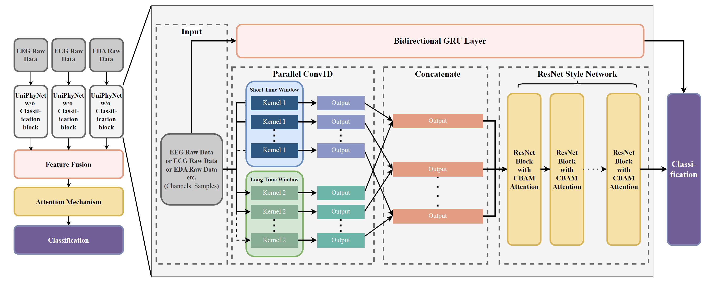

# UniPhyNet: A Unified Network For Multimodal Physiological Raw Signal Classification

We present UniPhyNet, a novel neural network architecture to classify cognitive load using multimodal physiological raw data - specifically EEG, ECG and EDA signals - without the explicit need for feature extraction. UniPhyNet integrates multiscale parallel convolutional blocks and ResNet-type blocks enhanced with channel block attention module to focus on informative features while a bidirectional gated recurrent unit is used to capture temporal dependencies. This architecture processes and combines signals in both unimodal and multimodal configurations via intermediate fusion. Evaluated on the CL-Drive dataset, UniPhyNet demonstrates superior performance over feature-based models in both binary and ternary classification tasks, showing large improvements in accuracy.

